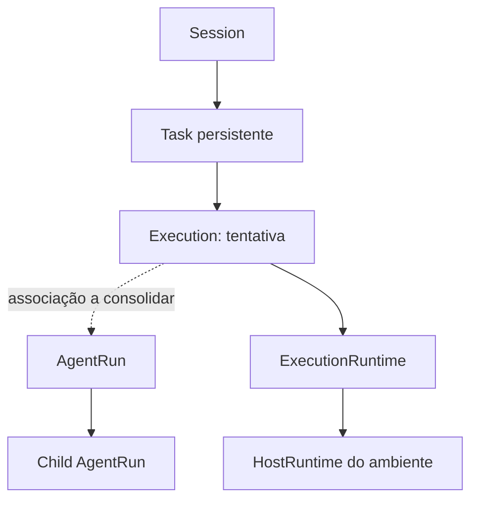

# Session, Task, Execution e AgentRun

A distinção conceitual é aceita; a representação completa ainda precisa ser consolidada antes da execução real.

| Conceito | Responsabilidade | Relação prevista |
|---|---|---|
| Session | Contexto conversacional e fluxo do usuário | Possui root agent; pode originar várias tasks |
| Task | Unidade persistente de trabalho | Possui objetivo e destino; pode existir sem session |
| Execution | Tentativa de executar uma Task em um runtime | Deve permitir identificar tentativa, ambiente e resultado |
| AgentRun | Execução de um agente, inclusive filho | Possui agente, input, estado, parentRunId e branchId |
| AgentTask | Payload entregue ao agente | Não substitui a entidade Task |

A linha pontilhada indica uma relação ainda não especificada. Não assumir que Task, Execution e AgentRun terão IDs ou estados intercambiáveis. A fonte descreve Execution como conceito, mas não fornece sua interface.

`Session` e `AgentRun` usam `Date` nos exemplos; `Task` usa timestamps `string`. Antes de persistir ou atravessar IPC, decidir a representação serializada e a conversão nos limites. O estado genérico `waiting` de Task/UI não substitui automaticamente `waiting_tool` e `waiting_child` de AgentRun.

Reexecução, recuperação após falha e retomada depois de restart ainda não possuem regras. Sobrevivência de task remota ao desligamento do Desktop é uma capacidade futura, não promessa para runs locais no primeiro milestone.

---

[Início](../Inicio.md) · [Índice da área](Indice.md) · [Dominio](../Contratos/Dominio.md) · [Runtime distribuido](Runtime-distribuido.md) · [Pendencias](../Roadmap/Pendencias.md)
