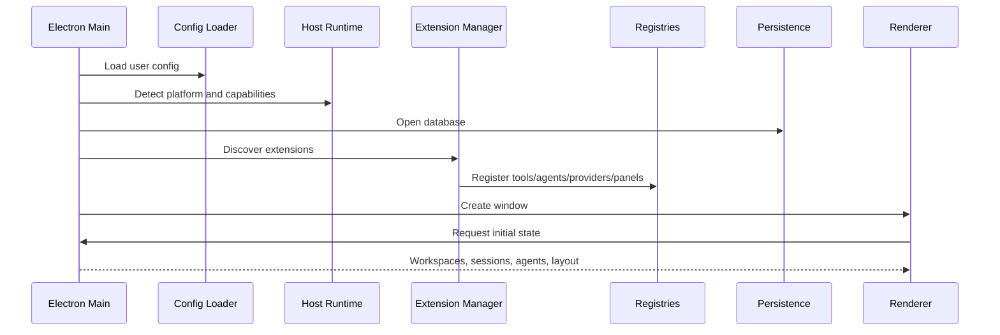
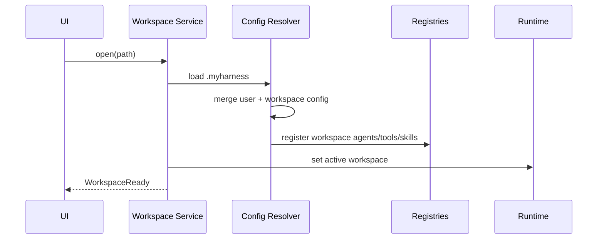
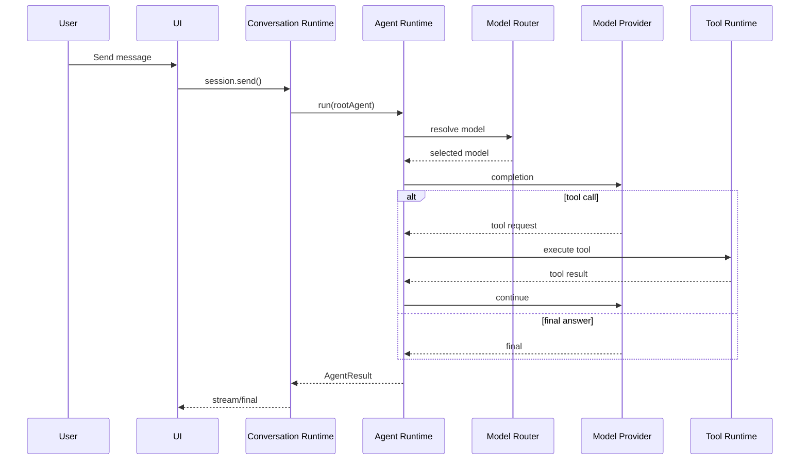
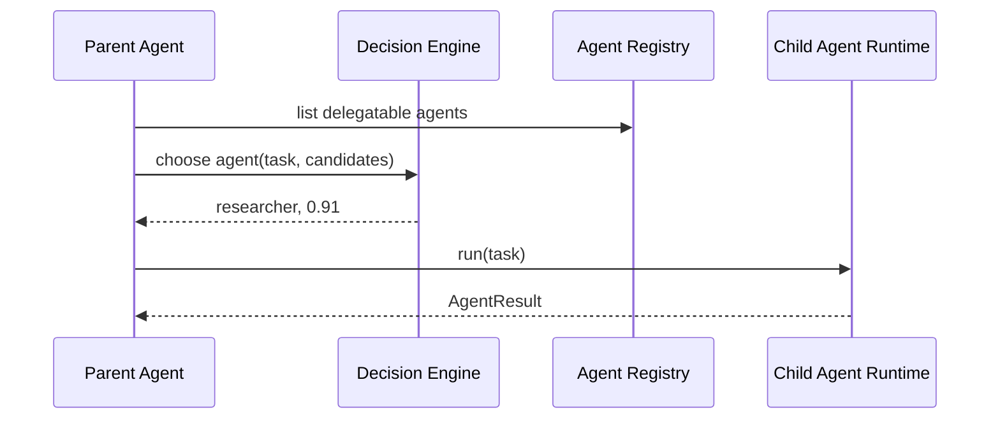

# Fluxos de aplicação

Os diagramas descrevem a arquitetura alvo. Nas fases 1 e 2, serviços mockados atendem os mesmos limites da aplicação; descoberta de extensões e roteamento inteligente não precisam estar implementados. No fluxo de mensagem, Model Provider representa a cadeia LLMService → PiAILLMService → pi-ai.

> **Estado do projeto:** arquitetura planejada; não há implementação no repositório na criação deste cofre. Decisões aceitas não significam funcionalidades entregues.

## 44. Fluxo de inicialização

---

## 45. Fluxo ao abrir um projeto

---

## 46. Fluxo de uma mensagem

---

## 47. Fluxo de delegação automática

---

---

[Início](../Inicio.md) · [Índice da área](Indice.md) · [Pendencias](../Roadmap/Pendencias.md)
