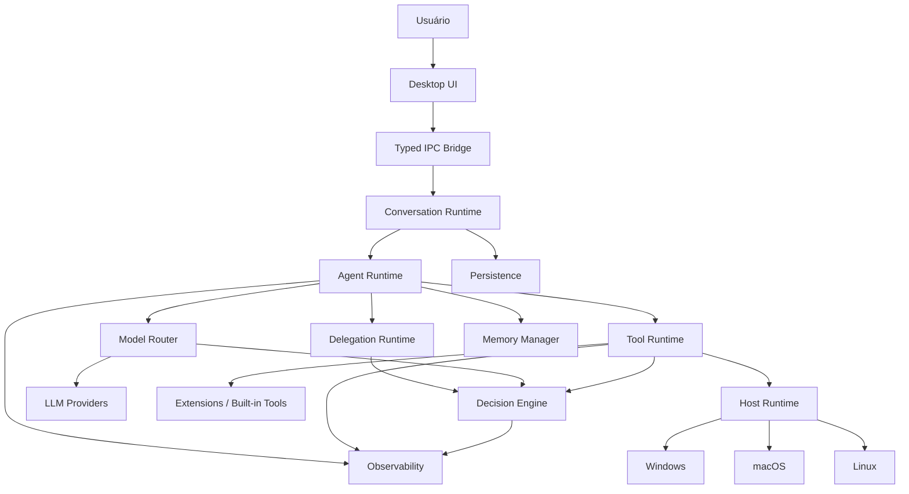

# Princípios e camadas

Estes princípios orientam dependências entre módulos. O diagrama de alto nível é conceitual: a integração de modelos deverá seguir a fachada LLMService e a execução deverá respeitar ExecutionRuntime, mesmo quando esses limites não aparecem no desenho original.

> **Estado do projeto:** arquitetura planejada; não há implementação no repositório na criação deste cofre. Decisões aceitas não significam funcionalidades entregues.

## 2. Princípios arquiteturais

### 2.1 Agent != Model

Um modelo é apenas um mecanismo de inferência.

Um agente é composto por:

```text
Agent
 ├─ identity
 ├─ model policy
 ├─ system prompt
 ├─ tools
 ├─ skills
 ├─ permissions
 ├─ memory policy
 ├─ delegation policy
 └─ runtime policy
```

O mesmo agente pode trocar de modelo sem perder sua identidade.

---

### 2.2 Session != Agent

Uma sessão representa uma conversa ou fluxo de trabalho.

Cada sessão possui um **root agent**.

Esse agente pode ser:

- o generalista padrão;
- um agente criado pelo usuário;
- um agente do projeto;
- um agente instalado por extensão.

O root agent não é um tipo especial de agente. Ele é apenas o agente raiz da sessão atual.

---

### 2.3 Session != Task != Execution

A arquitetura não deve tratar uma sessão de conversa como sinônimo de uma execução em andamento.

- **Session** representa o contexto conversacional e o fluxo de trabalho do usuário.
- **Task** representa uma unidade persistente de trabalho solicitada por um usuário ou agente.
- **Execution** representa uma tentativa concreta de executar uma Task em um runtime específico.

Uma mesma sessão poderá, no futuro, originar várias tasks, inclusive executadas em locais diferentes:

```text
Session
 ├─ Task A → local
 ├─ Task B → remote runtime
 └─ Task C → remote runtime
```

Esse desacoplamento deve existir desde o MVP, ainda que a única implementação inicial seja local. Nenhuma entidade central deve depender da hipótese de que a UI, o Agent Runtime e o ambiente de execução estão no mesmo processo ou na mesma máquina.

---

### 2.4 Agentes são declarativos

O usuário deve conseguir criar um agente sem escrever código.

Exemplo conceitual:

```yaml
id: pokemon-specialist
name: Pokémon Specialist
scope: user

routing:
  description: Especialista em jogos Pokémon, mecânicas, emulação e estratégias.
  preferred_tasks:
    - pokemon
    - mechanics
    - emulation

model:
  provider: openai
  model: gpt-example

prompt:
  user_instructions: |
    Você é especialista na franquia Pokémon...

tools:
  - web.search
  - files.read

delegation:
  can_receive: true
  can_delegate: true
  allowed_agents:
    - researcher
```

---

### 2.5 Prompt do usuário não é o prompt final

O texto definido pelo usuário deve ser anexado a prompts internos do harness.

```text
Core Prompt
   +
Runtime Prompt
   +
Environment Prompt
   +
Tool Policies
   +
Delegation Policies
   +
Project Context
   +
User-defined Agent Prompt
```

Isso mantém invariantes do runtime sob controle do harness.

---

### 2.6 Capability over platform checks

Tools e extensões não devem espalhar lógica como:

```ts
if (process.platform === 'win32') { ... }
```

Elas devem consumir capacidades abstratas:

```ts
context.host.process.spawn(...)
context.host.paths.join(...)
context.host.shell.execute(...)
```

---

### 2.7 Segurança por capacidade

Toda extensão, tool ou agente deve trabalhar com o princípio de menor privilégio.

Exemplo:

```yaml
permissions:
  filesystem:
    read:
      - workspace
    write:
      - workspace/.harness/cache

  process:
    execute:
      - git
      - node

  network:
    allowed_domains:
      - api.github.com
```

---

## 3. Arquitetura de alto nível



---

## 66. Resumo da arquitetura

A arquitetura recomendada pode ser resumida nas seguintes camadas principais:

```text
┌─────────────────────────────────────────────┐
│                 Desktop UI                  │
│ React / Docking / Sessions / Agent Designer │
├─────────────────────────────────────────────┤
│             Conversation Runtime            │
│ Sessions / Branches / Root Agents / Events  │
├─────────────────────────────────────────────┤
│                 Agent Runtime               │
│ Loop / Context / Delegation / Memory        │
├─────────────────────────────────────────────┤
│           Decision & Routing Layer          │
│ Agent / Model / Tool / Safety Decisions     │
├─────────────────────────────────────────────┤
│       Tool & Extension Runtime              │
│ Tools / Skills / Extensions / Permissions   │
├─────────────────────────────────────────────┤
│             Execution Runtime               │
│ Tasks / Targets / Local now, Remote later   │
├─────────────────────────────────────────────┤
│               Provider Layer                │
│ pi-ai / Decision Providers                  │
├─────────────────────────────────────────────┤
│                Host Runtime                 │
│ Files / Shell / Process / OS / Secrets      │
└─────────────────────────────────────────────┘
```

A decisão central é manter **agentes, modelos, tools, extensões e sistema operacional como conceitos separados**, conectados por contratos explícitos.

Isso permite que o harness continue simples no MVP, mas possa evoluir para uma plataforma de agentes desktop sem exigir uma reescrita estrutural posteriormente.

---

---

[Início](../Inicio.md) · [Índice da área](Indice.md) · [Pendencias](../Roadmap/Pendencias.md)
