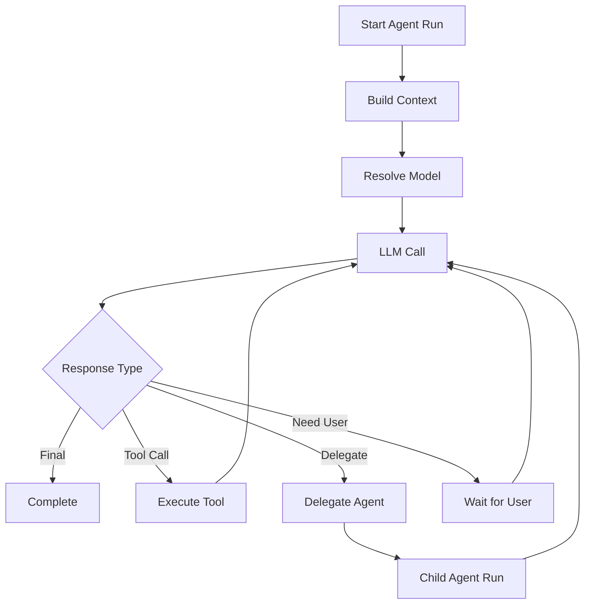

# Agentes, loop e delegação

> **Atualização de 03/10/2026:** a [fase 2 implementada](Fase-2-implementada.md) entrega pi-ai real, SQLite, sessões por pasta e ferramentas locais sem pedidos de permissão. As seções abaixo preservam a arquitetura planejada; recursos além desse incremento continuam futuros.

> **Atualização de 05/10/2026:** agentes YAML, snapshots por sessão, `delegate_task` síncrona, runs filhos persistidos, cancelamento em árvore e painel Subagente foram implementados. Delegação paralela, background após fechar o app e retomada continuam futuras.

## Contrato implementado

Agentes de usuário ficam em `~/.computador/agents`; agentes do projeto ativo ficam em `.computador/agents`. O arquivo mínimo é:

```yaml
version: 1
id: personal
name: Computador
description: Agente pessoal para tarefas gerais.
system_prompt: |
  Você é o agente pessoal do usuário.
```

`model`, `thinking_level` e `runtime` são opcionais. O runtime aceita `max_delegation_depth`, `max_concurrent_subagents`, `max_turns`, `max_tool_calls` e `timeout_seconds`. Arquivos inválidos são diagnosticados e excluídos do catálogo executável. O app garante ao menos um agente de usuário válido.

A tool `delegate_task` recebe `task`, `agent` opcional e `context` opcional. Sem `agent`, o filho usa um snapshot do chamador. Filhos recebem o mesmo workspace, mas não herdam automaticamente o histórico do pai.


Todos os agentes compartilham o contrato de runtime, mas cada run mantém identidade, estado e limites próprios. Delegação cria um child run independente. Fechar um painel não cancela uma execução em background; sobrevivência ao encerramento do aplicativo não é uma garantia do MVP.

> **Estado do projeto:** o fluxo síncrono local está implementado; as seções marcadas como futuras permanecem planejamento.

## 7. Agent Runtime

O `AgentRuntime` é o núcleo executável do harness.

Todos os agentes usam o mesmo runtime.

```ts
interface AgentRuntime {
  run(request: AgentRunRequest): Promise<AgentResult>;
  cancel(runId: string): Promise<void>;
  resume(runId: string, input: RuntimeResumeInput): Promise<AgentResult>;
}
```

Responsabilidades:

- montar o contexto;
- resolver prompt;
- resolver modelo;
- selecionar tools;
- executar loop agêntico;
- tratar tool calls;
- tratar delegação;
- persistir eventos;
- emitir streaming;
- aplicar limites;
- controlar recursão;
- aplicar políticas;
- gerar traces.

---

## 8. Loop agêntico

Fluxo simplificado:



---

## 9. Delegação entre agentes

A delegação não deve ser um `while` literal aninhado.

Ela deve criar uma nova execução independente.

```text
Parent AgentRun
    ↓
delegate_task
    ↓
Child AgentRun
    ↓
AgentResult
    ↓
Parent AgentRun resumes
```

### 9.1 Tipos de delegação

#### Síncrona

O pai aguarda o filho.

#### Paralela

Vários agentes são executados simultaneamente.

#### Background

O agente continua sua execução enquanto o subagente trabalha.

#### Branch

Uma conversa pode continuar a partir do mesmo ponto usando outro root agent.

---

### 9.2 Limites

Obrigatórios:

```ts
interface RuntimeLimits {
  maxAgentDepth: number;
  maxConcurrentAgents: number;
  maxRunsPerSession: number;
  maxToolCallsPerRun: number;
  maxWallClockTimeMs: number;
  maxTokenBudget?: number;
  maxCostBudget?: number;
}
```

Isso evita loops de delegação infinitos.

---

## 35. Concorrência

Subagentes paralelos exigem um scheduler.

```ts
interface AgentScheduler {
  enqueue(run: AgentRun): Promise<void>;
  cancel(runId: string): Promise<void>;
  setConcurrency(limit: number): void;
}
```

O scheduler também pode aplicar budgets.

---

## 36. Background agents

Runs em background devem sobreviver à troca de painel.

A UI pode exibir:

```text
Active Runs

● Researcher
  Pesquisando alternativas...

● Programmer
  Rodando testes...
```

Se necessário futuramente, runs podem sobreviver ao restart da UI e serem restaurados pelo Main Process.

---

---

[Início](../Inicio.md) · [Índice da área](Indice.md) · [Pendencias](../Roadmap/Pendencias.md) · [Indice](../Contratos/Indice.md)
