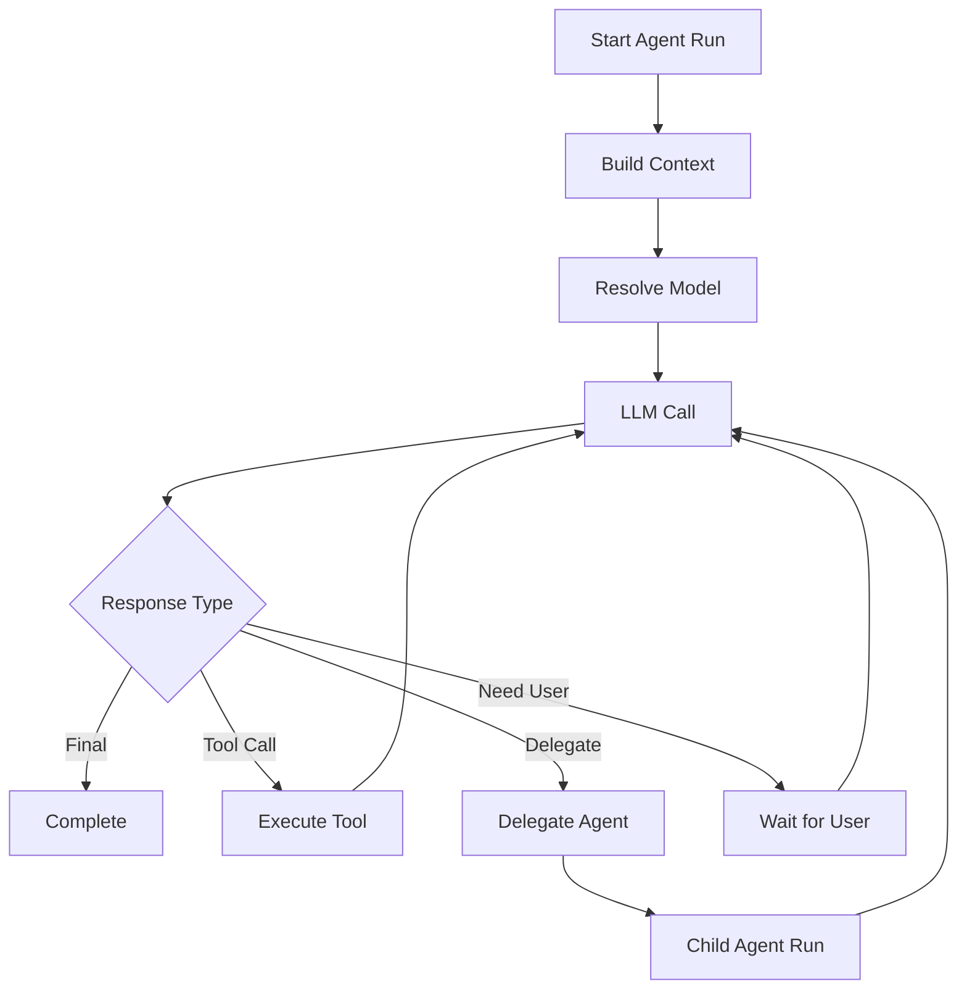

# Agentes, loop e delegação

Todos os agentes compartilham o contrato de runtime, mas cada run mantém identidade, estado e limites próprios. Delegação cria um child run independente. Fechar um painel não cancela uma execução em background; sobrevivência ao encerramento do aplicativo não é uma garantia do MVP.

> **Estado do projeto:** arquitetura planejada; não há implementação no repositório na criação deste cofre. Decisões aceitas não significam funcionalidades entregues.

## 7. Agent Runtime

O `AgentRuntime` é o núcleo executável do harness.

Todos os agentes usam o mesmo runtime.

```ts
interface AgentRuntime {
  run(request: AgentRunRequest): Promise<AgentResult>;
  cancel(runId: string): Promise<void>;
  resume(runId: string, input: RuntimeResumeInput): Promise<AgentResult>;
}
```

Responsabilidades:

- montar o contexto;
- resolver prompt;
- resolver modelo;
- selecionar tools;
- executar loop agêntico;
- tratar tool calls;
- tratar delegação;
- persistir eventos;
- emitir streaming;
- aplicar limites;
- controlar recursão;
- aplicar políticas;
- gerar traces.

---

## 8. Loop agêntico

Fluxo simplificado:



---

## 9. Delegação entre agentes

A delegação não deve ser um `while` literal aninhado.

Ela deve criar uma nova execução independente.

```text
Parent AgentRun
    ↓
delegate_task
    ↓
Child AgentRun
    ↓
AgentResult
    ↓
Parent AgentRun resumes
```

### 9.1 Tipos de delegação

#### Síncrona

O pai aguarda o filho.

#### Paralela

Vários agentes são executados simultaneamente.

#### Background

O agente continua sua execução enquanto o subagente trabalha.

#### Branch

Uma conversa pode continuar a partir do mesmo ponto usando outro root agent.

---

### 9.2 Limites

Obrigatórios:

```ts
interface RuntimeLimits {
  maxAgentDepth: number;
  maxConcurrentAgents: number;
  maxRunsPerSession: number;
  maxToolCallsPerRun: number;
  maxWallClockTimeMs: number;
  maxTokenBudget?: number;
  maxCostBudget?: number;
}
```

Isso evita loops de delegação infinitos.

---

## 35. Concorrência

Subagentes paralelos exigem um scheduler.

```ts
interface AgentScheduler {
  enqueue(run: AgentRun): Promise<void>;
  cancel(runId: string): Promise<void>;
  setConcurrency(limit: number): void;
}
```

O scheduler também pode aplicar budgets.

---

## 36. Background agents

Runs em background devem sobreviver à troca de painel.

A UI pode exibir:

```text
Active Runs

● Researcher
  Pesquisando alternativas...

● Programmer
  Rodando testes...
```

Se necessário futuramente, runs podem sobreviver ao restart da UI e serem restaurados pelo Main Process.

---

---

[Início](../Inicio.md) · [Índice da área](Indice.md) · [Pendencias](../Roadmap/Pendencias.md) · [Indice](../Contratos/Indice.md)
