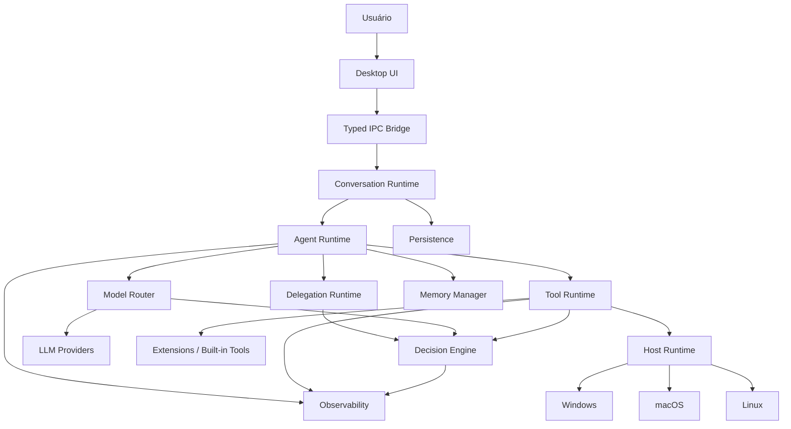
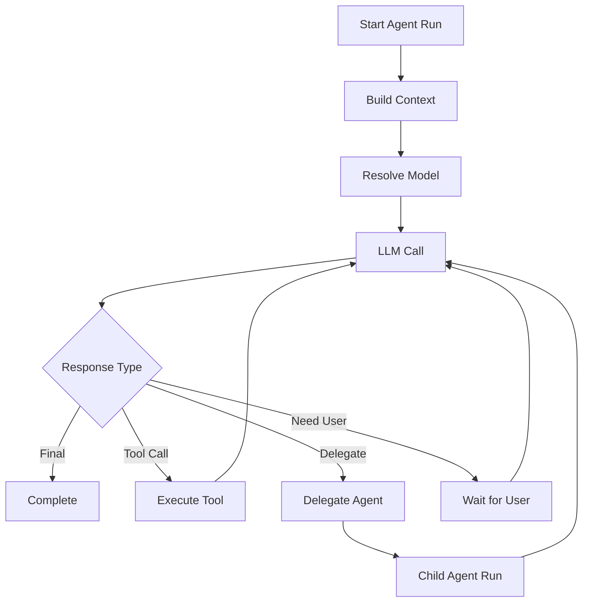
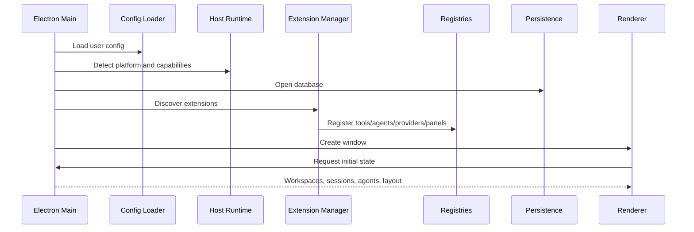
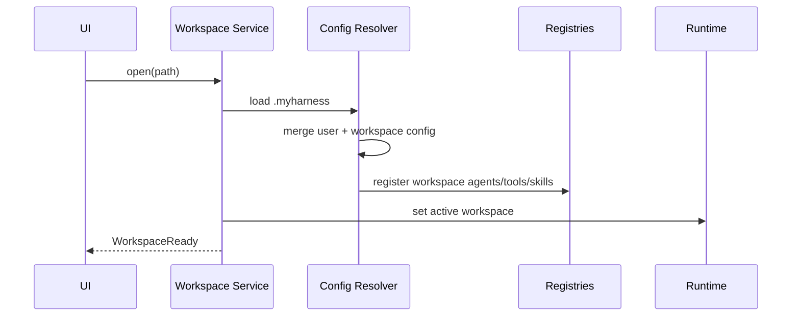
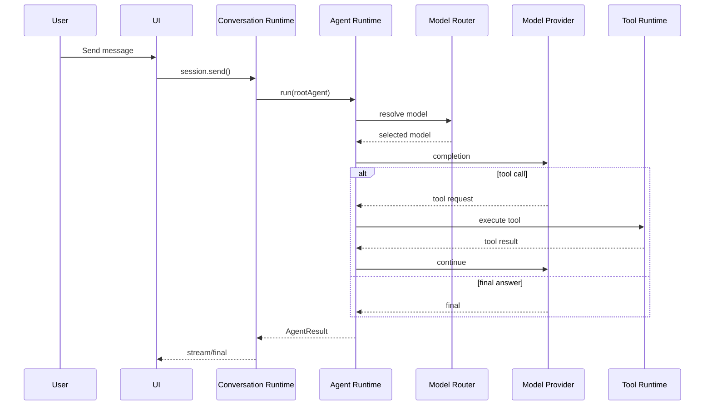
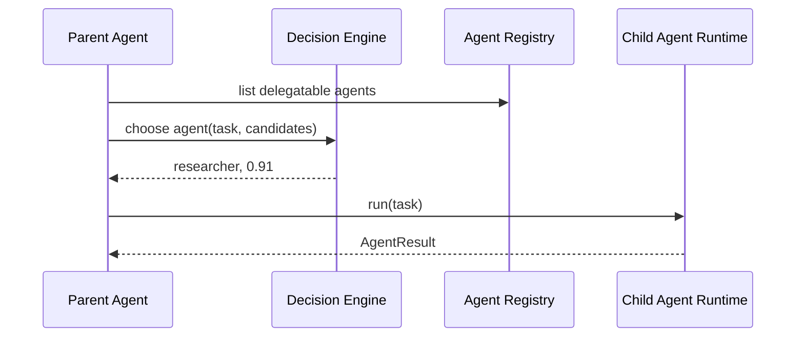

# Arquitetura do Harness Desktop Agêntico

> **Atualização de arquitetura — 01/10/2026:** o MVP passa a adotar estratégia frontend-first com serviços mockados, UI modular baseada em painéis registráveis e integração de LLM delegada ao `pi-ai` por uma fachada fina (`LLMService`).

**Status:** proposta arquitetural inicial  
**Formato:** documento versionável para repositório  
**Escopo:** aplicação desktop multiplataforma, generalista, extensível e orientada a agentes  
**Plataformas alvo:** Windows, macOS e Linux  
**Stack de referência:** Electron + React + TypeScript

---

## 1. Visão do produto

O objetivo é construir um **harness desktop generalista para agentes**, com experiência visual semelhante a ferramentas como IDEs modernas, mas sem ser limitado a programação.

O produto deve permitir que o usuário:

- converse com um agente generalista ou inicie uma sessão diretamente com qualquer agente;
- crie agentes próprios por configuração, sem precisar programar;
- defina provider, modelo, system prompt, tools, skills, permissões e regras de delegação;
- tenha agentes globais, agentes específicos por projeto e agentes vindos de extensões;
- permita que agentes deleguem tarefas para outros agentes;
- utilize modelos especializados em decisão para roteamento de agentes, modelos e tools;
- use tools determinísticas implementadas como extensões executáveis;
- opere em Windows, Linux e macOS com uma camada de abstração de host;
- tenha uma interface com painéis reposicionáveis, layouts salvos e visão clara das execuções dos agentes;
- trabalhe tanto em modo "projeto", associado a uma pasta, quanto em modo pessoal/global;
- execute modelos locais e remotos por meio de uma camada uniforme de providers.

A arquitetura deve privilegiar:

- extensibilidade;
- isolamento;
- observabilidade;
- segurança;
- testabilidade;
- baixo acoplamento entre UI, runtime, providers e extensões;
- configuração declarativa;
- versionamento opcional de configurações por projeto.

---

# 2. Princípios arquiteturais

## 2.1 Agent != Model

Um modelo é apenas um mecanismo de inferência.

Um agente é composto por:

```text
Agent
 ├─ identity
 ├─ model policy
 ├─ system prompt
 ├─ tools
 ├─ skills
 ├─ permissions
 ├─ memory policy
 ├─ delegation policy
 └─ runtime policy
```

O mesmo agente pode trocar de modelo sem perder sua identidade.

---

## 2.2 Session != Agent

Uma sessão representa uma conversa ou fluxo de trabalho.

Cada sessão possui um **root agent**.

Esse agente pode ser:

- o generalista padrão;
- um agente criado pelo usuário;
- um agente do projeto;
- um agente instalado por extensão.

O root agent não é um tipo especial de agente. Ele é apenas o agente raiz da sessão atual.

---

## 2.3 Session != Task != Execution

A arquitetura não deve tratar uma sessão de conversa como sinônimo de uma execução em andamento.

- **Session** representa o contexto conversacional e o fluxo de trabalho do usuário.
- **Task** representa uma unidade persistente de trabalho solicitada por um usuário ou agente.
- **Execution** representa uma tentativa concreta de executar uma Task em um runtime específico.

Uma mesma sessão poderá, no futuro, originar várias tasks, inclusive executadas em locais diferentes:

```text
Session
 ├─ Task A → local
 ├─ Task B → remote runtime
 └─ Task C → remote runtime
```

Esse desacoplamento deve existir desde o MVP, ainda que a única implementação inicial seja local. Nenhuma entidade central deve depender da hipótese de que a UI, o Agent Runtime e o ambiente de execução estão no mesmo processo ou na mesma máquina.

---

## 2.4 Agentes são declarativos

O usuário deve conseguir criar um agente sem escrever código.

Exemplo conceitual:

```yaml
id: pokemon-specialist
name: Pokémon Specialist
scope: user

routing:
  description: Especialista em jogos Pokémon, mecânicas, emulação e estratégias.
  preferred_tasks:
    - pokemon
    - mechanics
    - emulation

model:
  provider: openai
  model: gpt-example

prompt:
  user_instructions: |
    Você é especialista na franquia Pokémon...

tools:
  - web.search
  - files.read

delegation:
  can_receive: true
  can_delegate: true
  allowed_agents:
    - researcher
```

---

## 2.5 Prompt do usuário não é o prompt final

O texto definido pelo usuário deve ser anexado a prompts internos do harness.

```text
Core Prompt
   +
Runtime Prompt
   +
Environment Prompt
   +
Tool Policies
   +
Delegation Policies
   +
Project Context
   +
User-defined Agent Prompt
```

Isso mantém invariantes do runtime sob controle do harness.

---

## 2.6 Capability over platform checks

Tools e extensões não devem espalhar lógica como:

```ts
if (process.platform === 'win32') { ... }
```

Elas devem consumir capacidades abstratas:

```ts
context.host.process.spawn(...)
context.host.paths.join(...)
context.host.shell.execute(...)
```

---

## 2.7 Segurança por capacidade

Toda extensão, tool ou agente deve trabalhar com o princípio de menor privilégio.

Exemplo:

```yaml
permissions:
  filesystem:
    read:
      - workspace
    write:
      - workspace/.harness/cache

  process:
    execute:
      - git
      - node

  network:
    allowed_domains:
      - api.github.com
```

---

# 3. Arquitetura de alto nível



---

# 4. Processos do Electron

A aplicação deve respeitar a separação de processos do Electron.

## 4.1 Main Process

Responsabilidades:

- bootstrap da aplicação;
- criação e ciclo de vida das janelas;
- Host Runtime;
- filesystem;
- processos externos;
- armazenamento seguro de credenciais;
- banco local;
- runtime de agentes;
- runtime de tools e extensões;
- providers;
- IPC seguro com o renderer.

O Main Process é a camada privilegiada da aplicação.

---

## 4.2 Preload

O preload deve expor uma API mínima e tipada ao renderer.

Nunca expor diretamente:

- `fs`;
- `child_process`;
- `process`;
- `ipcRenderer` genérico;
- módulos Node arbitrários.

Exemplo:

```ts
contextBridge.exposeInMainWorld('harness', {
  sessions: sessionApi,
  agents: agentApi,
  workspace: workspaceApi,
  layout: layoutApi,
  runtime: runtimeApi,
});
```

---

## 4.3 Renderer

Stack recomendada:

- React;
- TypeScript;
- Vite;
- Dockview ou biblioteca equivalente para docking;
- Zustand para estado de UI;
- TanStack Query para estado assíncrono;
- componentes próprios + biblioteca headless;
- CSS utility-first ou CSS Modules conforme preferência.

Responsabilidades:

- UI;
- layouts;
- interação;
- renderização de sessões;
- painel de agentes;
- painel de runs;
- configurações;
- gerenciamento visual de extensões;
- logs e diagnostics.

O renderer não deve conter lógica privilegiada de SO ou execução de processos.

---

# 5. Workspace e escopos de configuração

O harness deve possuir pelo menos três níveis de configuração:

```text
Global/User
   ↓
Workspace/Project
   ↓
Session
```

## 5.1 Configuração global

Exemplo conceitual:

```text
~/.myharness/
├─ config.json
├─ agents/
├─ skills/
├─ extensions/
├─ layouts/
├─ cache/
└─ logs/
```

Nunca armazenar secrets em arquivos versionáveis.

---

## 5.2 Configuração por projeto

Dentro do projeto:

```text
project-root/
├─ .myharness/
│  ├─ config.json
│  ├─ agents/
│  ├─ skills/
│  ├─ rules/
│  ├─ layouts/
│  └─ extensions/
├─ src/
└─ ...
```

Essa pasta pode ou não ser versionada.

A decisão deve ser do usuário.

---

## 5.3 Merge de configuração

Ordem de precedência:

```text
Built-in defaults
   ↓
User config
   ↓
Project config
   ↓
Session override
```

Um agente de projeto pode:

- sobrescrever um agente global;
- estender um agente global;
- adicionar instruções de projeto;
- restringir tools;
- alterar modelo;
- alterar permissões.

Exemplo:

```text
Global: Software Architect
  prompt: princípios gerais
  tools: files, web

Project override:
  appendPrompt: este projeto usa Laravel, React e PostgreSQL
  tools: files, web, git
```

---

# 6. Modelo de domínio principal

## 6.1 AgentDefinition

```ts
interface AgentDefinition {
  id: string;
  name: string;
  description: string;
  scope: 'builtin' | 'user' | 'workspace' | 'extension';

  routing: AgentRoutingProfile;

  modelPolicy: ModelPolicy;

  prompts: {
    userSystemPrompt: string;
    projectPrompt?: string;
  };

  tools: ToolReference[];
  skills: SkillReference[];

  permissions: PermissionPolicy;
  memoryPolicy: MemoryPolicy;
  delegationPolicy: DelegationPolicy;
  runtimePolicy: AgentRuntimePolicy;

  metadata?: Record<string, unknown>;
}
```

---

## 6.2 AgentRoutingProfile

```ts
interface AgentRoutingProfile {
  description: string;
  preferredTasks?: string[];
  excludedTasks?: string[];
  capabilities?: string[];
  keywords?: string[];
}
```

O router usa esse perfil, não o system prompt completo.

---

## 6.3 Session

```ts
interface Session {
  id: string;
  workspaceId?: string;
  title?: string;

  rootAgentId: string;

  messages: MessageRef[];
  branches: SessionBranch[];

  createdAt: Date;
  updatedAt: Date;
}
```

---

## 6.4 AgentRun

```ts
interface AgentRun {
  id: string;
  sessionId: string;
  agentId: string;

  parentRunId?: string;
  branchId?: string;

  status:
    | 'queued'
    | 'running'
    | 'waiting_tool'
    | 'waiting_child'
    | 'completed'
    | 'failed'
    | 'cancelled';

  input: AgentTask;
  result?: AgentResult;

  startedAt?: Date;
  finishedAt?: Date;
}
```

---

## 6.5 AgentTask

```ts
interface AgentTask {
  objective: string;
  context?: string;
  constraints?: string[];
  expectedOutput?: string;
  artifacts?: ArtifactRef[];
  parentContextRefs?: ContextRef[];
}
```

---

## 6.6 AgentResult

```ts
interface AgentResult {
  status: 'success' | 'failed' | 'needs_input';
  summary: string;
  output?: string;
  artifacts?: ArtifactRef[];
  decisions?: DecisionRecord[];
  suggestedNextSteps?: string[];
}
```

---

# 7. Agent Runtime

O `AgentRuntime` é o núcleo executável do harness.

Todos os agentes usam o mesmo runtime.

```ts
interface AgentRuntime {
  run(request: AgentRunRequest): Promise<AgentResult>;
  cancel(runId: string): Promise<void>;
  resume(runId: string, input: RuntimeResumeInput): Promise<AgentResult>;
}
```

Responsabilidades:

- montar o contexto;
- resolver prompt;
- resolver modelo;
- selecionar tools;
- executar loop agêntico;
- tratar tool calls;
- tratar delegação;
- persistir eventos;
- emitir streaming;
- aplicar limites;
- controlar recursão;
- aplicar políticas;
- gerar traces.

---

# 8. Loop agêntico

Fluxo simplificado:



---

# 9. Delegação entre agentes

A delegação não deve ser um `while` literal aninhado.

Ela deve criar uma nova execução independente.

```text
Parent AgentRun
    ↓
delegate_task
    ↓
Child AgentRun
    ↓
AgentResult
    ↓
Parent AgentRun resumes
```

## 9.1 Tipos de delegação

### Síncrona

O pai aguarda o filho.

### Paralela

Vários agentes são executados simultaneamente.

### Background

O agente continua sua execução enquanto o subagente trabalha.

### Branch

Uma conversa pode continuar a partir do mesmo ponto usando outro root agent.

---

## 9.2 Limites

Obrigatórios:

```ts
interface RuntimeLimits {
  maxAgentDepth: number;
  maxConcurrentAgents: number;
  maxRunsPerSession: number;
  maxToolCallsPerRun: number;
  maxWallClockTimeMs: number;
  maxTokenBudget?: number;
  maxCostBudget?: number;
}
```

Isso evita loops de delegação infinitos.

---

# 10. Decision Engine

O Decision Engine deve ser uma abstração independente dos agentes.

Ele é usado para decisões classificatórias ou probabilísticas.

```ts
interface DecisionEngine {
  decide<TOption>(request: DecisionRequest<TOption>): Promise<DecisionResult<TOption>>;
}
```

Usos:

- Agent Router;
- Model Router;
- Tool Router;
- autonomia;
- gates de segurança;
- seleção de contexto;
- seleção de estratégia;
- triagem de tarefas.

---

## 10.1 Agent Router

Pergunta conceitual:

> Qual agente deve executar esta tarefa?

Entrada:

```ts
{
  task,
  candidateAgents: routingProfiles
}
```

Saída:

```ts
{
  selected: 'researcher',
  confidence: 0.88,
  alternatives: [
    { id: 'general', confidence: 0.09 },
    { id: 'programmer', confidence: 0.03 }
  ]
}
```

---

## 10.2 Model Router

Pergunta conceitual:

> Qual modelo deve executar esta tarefa dentro deste agente?

Pode considerar:

- complexidade;
- latência;
- custo;
- privacidade;
- disponibilidade local;
- tamanho do contexto;
- suporte a tool calling;
- suporte multimodal;
- nível de risco.

---

## 10.3 Tool Router

Pergunta conceitual:

> Quais tools são relevantes para esta execução?

Isso evita enviar dezenas de schemas de tools ao modelo sem necessidade.

---

## 10.4 Política de confiança

Exemplo:

```ts
if (decision.confidence >= 0.85) {
  autoExecute();
} else if (decision.confidence >= 0.60) {
  suggestToUser();
} else {
  fallbackToRootAgent();
}
```

Os limites devem ser configuráveis.

---

# 11. Integração com LLMs via pi-ai

O harness **não deve reimplementar a abstração de providers e modelos**. Essa responsabilidade será delegada ao `pi-ai`, que passa a ser a camada especializada de integração com LLMs.

O projeto deve manter apenas uma fachada fina própria para evitar espalhar a API concreta do `pi-ai` por todo o código:

```ts
interface LLMService {
  getProviders(): Promise<ProviderDescriptor[]>;
  getModels(providerId?: string): Promise<ModelDescriptor[]>;
  complete(request: LLMRequest): Promise<LLMResponse>;
  stream(request: LLMRequest): AsyncIterable<LLMEvent>;
}
```

Implementação inicial:

```ts
class PiAILLMService implements LLMService {
  // delega para pi-ai
}
```

Regra arquitetural:

```text
AgentRuntime
   ↓
LLMService
   ↓
PiAILLMService
   ↓
pi-ai
   ↓
Providers / Models
```

Somente `PiAILLMService` conhece diretamente o `pi-ai`. O `AgentRuntime`, a UI e o domínio trabalham com os contratos internos do harness.

Isso evita recriar:

- conexão com providers;
- compatibilidade entre APIs;
- catálogo de modelos;
- streaming específico por provider;
- diferenças de tool calling entre providers.

---

# 12. Catálogo de modelos

O frontend não deve possuir uma lista hardcoded de providers ou modelos.

A UI consulta `LLMService`, que por sua vez obtém essas informações do `pi-ai`.

```ts
interface ModelRef {
  provider: string;
  modelId: string;
}
```

A definição de agente persiste apenas a referência necessária:

```ts
interface AgentModelConfig {
  provider: string;
  modelId: string;
}
```

Capabilities devem ser normalizadas pela fachada quando forem relevantes para o harness:

```ts
interface ModelCapabilities {
  toolCalling: boolean;
  vision: boolean;
  structuredOutput: boolean;
  reasoningLevels?: string[];
  contextWindow?: number;
}
```

---

# 13. Skills

Skill é conteúdo instrucional declarativo.

Exemplo:

```text
.myharness/skills/review-architecture.md
```

Pode conter:

- instruções;
- templates;
- checklists;
- exemplos;
- procedimentos.

Uma skill não possui acesso privilegiado ao SO por si só.

---

# 14. Extensions

Extensão é código executável.

Pode registrar:

- tools;
- panels de UI;
- commands;
- providers;
- agents;
- skills;
- listeners;
- background services.

Exemplo de manifesto:

```yaml
id: com.example.git-tools
name: Git Tools
version: 1.0.0
entry: dist/index.js

contributes:
  tools:
    - git.status
    - git.diff
  panels:
    - git-panel

permissions:
  filesystem:
    read:
      - workspace
  process:
    execute:
      - git
```

---

# 15. Runtime de extensões

Não executar extensões arbitrárias dentro do processo principal.

Arquitetura recomendada:

```text
Electron Main
    ↓
Extension Host
    ↓
Isolated Worker / Child Process
    ↓
Extension SDK
```

Possíveis estratégias:

1. Worker Threads para extensões confiáveis;
2. Child Processes para isolamento mais forte;
3. sandbox externo futuramente para código não confiável.

---

# 16. Extension SDK

```ts
interface ExtensionContext {
  host: HostRuntimeApi;
  workspace: WorkspaceApi;
  sessions: SessionApi;
  agents: AgentApi;
  secrets: SecretApi;
  logger: Logger;
}
```

A extensão não recebe módulos Node diretamente.

---

# 17. Tools

## 17.1 Tool Definition

```ts
interface ToolDefinition<TInput, TOutput> {
  id: string;
  name: string;
  description: string;
  inputSchema: JsonSchema;
  permissions: PermissionRequirement[];
  execute(input: TInput, context: ToolContext): Promise<TOutput>;
}
```

---

## 17.2 Built-in tools

Exemplos iniciais:

- `files.read`;
- `files.write`;
- `files.search`;
- `shell.execute`;
- `process.spawn`;
- `web.search`;
- `workspace.info`;
- `system.environment`;
- `agent.delegate`;
- `agent.parallel_delegate`;
- `artifact.create`.

---

# 18. Host Runtime

Camada responsável por abstrair o sistema operacional.

```ts
interface HostRuntime {
  platform: PlatformApi;
  filesystem: FilesystemApi;
  paths: PathApi;
  process: ProcessApi;
  shell: ShellApi;
  environment: EnvironmentApi;
  capabilities: HostCapabilities;
}
```

---

## 18.1 Platform API

```ts
interface PlatformInfo {
  os: 'windows' | 'linux' | 'macos';
  arch: 'x64' | 'arm64';
  homeDir: string;
  tempDir: string;
}
```

---

## 18.2 Shell Registry

Não assumir um shell por sistema operacional.

```text
Windows
 ├─ PowerShell
 ├─ CMD
 ├─ Git Bash
 └─ WSL

macOS
 ├─ zsh
 ├─ bash
 └─ fish

Linux
 ├─ bash
 ├─ zsh
 └─ fish
```

API:

```ts
interface ShellProvider {
  id: string;
  executable: string;
  available(): Promise<boolean>;
  execute(request: ShellRequest): Promise<ShellResult>;
}
```

---

## 18.3 Preferir spawn sem shell

Quando possível:

```ts
process.spawn('git', ['status'])
```

em vez de:

```text
shell.execute('git status')
```

Benefícios:

- segurança;
- escaping consistente;
- portabilidade;
- testabilidade.

---

# 19. Permissões

Modelo recomendado:

```ts
interface PermissionPolicy {
  filesystem?: FilesystemPermission;
  process?: ProcessPermission;
  network?: NetworkPermission;
  secrets?: SecretPermission;
  agents?: AgentPermission;
  tools?: ToolPermission;
}
```

Exemplo de política:

```yaml
filesystem:
  read:
    - workspace
  write:
    - workspace

process:
  execute:
    - git
    - node

network:
  mode: prompt
```

---

# 20. Consentimento e ações sensíveis

Tools devem declarar nível de risco.

```ts
risk: 'read' | 'write' | 'execute' | 'external_side_effect' | 'destructive'
```

A política do usuário pode ser:

```text
Read-only                 → automático
Write                     → automático ou confirmação
Execute external process  → confirmação opcional
External side effect      → confirmação obrigatória
Destructive               → confirmação obrigatória
```

---

# 21. Secrets

Nunca armazenar chaves em `.myharness/` do projeto.

Usar storage seguro da plataforma:

- Windows Credential Manager;
- macOS Keychain;
- Secret Service/libsecret em Linux;
- fallback criptografado apenas se necessário.

A configuração referencia apenas aliases:

```yaml
provider:
  api_key: secret://openai/main
```

---

# 22. Context Builder

Responsável por montar o contexto final enviado ao modelo.

Entradas possíveis:

- core prompt;
- agent prompt;
- project prompt;
- session context;
- conversation messages;
- memory;
- workspace facts;
- selected tools;
- active task;
- delegation results;
- artifacts.

---

## 22.1 Context Strategy

Cada agente pode definir:

```ts
type ContextStrategy =
  | 'full'
  | 'summary'
  | 'task-only'
  | 'adaptive';
```

Para subagentes, evitar enviar o histórico completo por padrão.

---

# 23. Memory

Separar pelo menos três níveis:

```text
Session Memory
Workspace Memory
User Memory
```

E opcionalmente:

```text
Agent-scoped Memory
```

A memória deve ser uma API independente do provider.

---

# 24. Conversas e branches

Uma conversa pode trocar de agente sem destruir o histórico.

Exemplo:

```text
Message A
  ↓
Message B
  ↓
Message C
  ├─ Branch: Programmer
  └─ Branch: Architect
```

Cada branch pode manter:

- root agent;
- modelo;
- resumo;
- contexto adicional;
- tool state.

---

# 25. UI extensível

A interface deve nascer modular, baseada em **painéis registráveis**, mesmo enquanto todos os painéis ainda forem internos ao produto.

O objetivo é que novas releases consigam adicionar painéis sem alterar a estrutura central do workspace e que, futuramente, extensões de terceiros possam contribuir com novos painéis por meio de um SDK controlado.

Exemplos de painéis core:

- Chat;
- Files;
- Sessions;
- Agents;
- Agent Runs;
- Terminal;
- Logs;
- Artifacts;
- Memory;
- Decision Trace;
- Extension Manager.

## 25.1 Panel Registry

```ts
interface PanelDefinition {
  id: string;
  title: string;
  icon?: string;
  component: React.ComponentType<PanelProps>;
  defaultLocation?: 'left' | 'right' | 'bottom' | 'center';
  capabilities?: string[];
}

interface PanelRegistry {
  register(panel: PanelDefinition): void;
  unregister(id: string): void;
  get(id: string): PanelDefinition | undefined;
  list(): PanelDefinition[];
}
```

O workspace não importa diretamente cada painel. Ele renderiza instâncias resolvidas pelo registry.

## 25.2 Panel Definition vs Panel Instance

Separar o tipo de painel de suas instâncias. Isso permite, por exemplo, dois terminais independentes.

```ts
interface PanelInstance {
  id: string;
  panelType: string;
  state?: unknown;
}
```

Exemplo:

```json
{
  "id": "terminal-7f2",
  "panelType": "terminal",
  "state": {
    "cwd": "/workspace/api"
  }
}
```

## 25.3 Layout serializável

O layout deve ser dado persistível e não conter referências diretas a componentes React.

```ts
interface LayoutPreset {
  id: string;
  name: string;
  scope: 'user' | 'workspace';
  dockState: unknown;
}
```

Um layout referencia apenas `panelId`/`panelInstanceId`. Isso permite:

- persistência por usuário;
- persistência por projeto;
- presets;
- migrações entre versões;
- compartilhamento futuro.

Presets futuros possíveis:

- General;
- Coding;
- Research;
- Writing;
- Minimal.

## 25.4 Comunicação entre painéis

Painéis não devem importar outros painéis diretamente.

Usar `CommandRegistry` para intenções e `EventBus` para notificações:

```ts
commands.execute('session.open', { sessionId });
events.subscribe('session.changed', handler);
```

Isso também prepara uma futura Command Palette.

## 25.5 Painéis como contribuição de Extension

No futuro, uma `Extension` poderá contribuir com diferentes capacidades:

```text
Extension
 ├─ panels
 ├─ commands
 ├─ tools
 ├─ skills
 ├─ agents
 └─ settings
```

Manifesto conceitual:

```json
{
  "id": "com.example.my-extension",
  "version": "1.0.0",
  "engines": {
    "harness": "^1.0"
  },
  "contributes": {
    "panels": [
      {
        "id": "my-panel",
        "title": "My Panel",
        "entry": "./dist/panel.js"
      }
    ]
  }
}
```

Extensões de terceiros **não recebem acesso direto ao Electron, Node, `fs` ou `child_process`**. Elas acessam o sistema por APIs controladas do harness e pelo Host Runtime, sujeitas a permissões.

## 25.6 Estratégia de implementação

No MVP, todos os painéis podem ser built-in, mas devem ser implementados usando o mesmo contrato de registro previsto para extensões futuras.

Assim, abrir o ecossistema depois deixa de exigir uma reescrita da UI: muda-se a origem do registro, não o modelo conceitual.

---

# 26. UI de criação de agentes

Campos recomendados:

```text
Identity
- Name
- Icon
- Description

Routing
- When to use
- Capabilities
- Excluded tasks

Model
- Provider
- Model
- Fixed / Automatic

Instructions
- System prompt

Tools
- Built-in tools
- Extension tools

Skills
- Selected skills

Delegation
- Can receive delegated tasks
- Can delegate
- Allowed agents
- Max delegation depth

Permissions
- Files
- Processes
- Network
- Secrets

Context
- Strategy
- Memory policy

Runtime
- Timeout
- Token budget
- Cost budget
```

---

# 27. Agent Registry

Todos os agentes devem ser resolvidos por ID.

```ts
interface AgentRegistry {
  register(agent: AgentDefinition): void;
  unregister(id: string): void;
  resolve(id: string, workspaceId?: string): AgentDefinition;
  list(filter?: AgentFilter): AgentDefinition[];
}
```

Ordem de resolução:

```text
Workspace
User
Extensions
Built-in
```

---

# 28. Tool Registry

```ts
interface ToolRegistry {
  register(tool: ToolDefinition<any, any>): void;
  resolve(id: string): ToolDefinition<any, any>;
  listAvailable(context: RuntimeContext): ToolDefinition<any, any>[];
}
```

Tools indisponíveis devido a permissões ou plataforma não devem ser expostas ao modelo.

---

# 29. Extension Registry

```ts
interface ExtensionRegistry {
  discover(): Promise<ExtensionManifest[]>;
  enable(id: string): Promise<void>;
  disable(id: string): Promise<void>;
  reload(id: string): Promise<void>;
}
```

---

# 30. Persistence

Recomendação inicial:

**SQLite** para dados estruturados locais.

Tabelas conceituais:

```text
workspaces
sessions
session_branches
messages
agents
agent_runs
tool_runs
decisions
artifacts
layouts
extensions
settings
memories
```

Arquivos grandes e artifacts podem permanecer no filesystem.

---

# 31. Event Bus

Criar um barramento interno de eventos.

Eventos exemplares:

```text
session.created
session.updated
agent.run.started
agent.run.completed
agent.run.failed
tool.run.started
tool.run.completed
decision.made
artifact.created
extension.enabled
workspace.opened
```

Isso reduz acoplamento entre runtime, UI e observabilidade.

---

# 32. Observabilidade

Cada execução precisa produzir trace.

Exemplo:

```text
Session
 └─ AgentRun #1
     ├─ ModelCall #1
     ├─ ToolRun #1
     ├─ Decision #1
     ├─ Child AgentRun #2
     │   ├─ ModelCall #2
     │   └─ ToolRun #2
     └─ ModelCall #3
```

Registrar:

- duração;
- provider;
- modelo;
- tokens;
- custo quando disponível;
- decisões;
- tool calls;
- erros;
- retries;
- contexto truncado;
- permissões concedidas.

---

# 33. Decision Trace

Uma tela avançada pode mostrar:

```text
Agent Router
Selected: Researcher
Confidence: 88%

Alternatives:
- General: 9%
- Programmer: 3%
```

Isso é útil para:

- debugging;
- confiança do usuário;
- ajuste de routing profiles;
- análise de custo.

---

# 34. Streaming

O runtime deve emitir eventos em streaming.

```ts
type RuntimeEvent =
  | { type: 'token'; data: string }
  | { type: 'tool-start'; toolId: string }
  | { type: 'tool-result'; result: unknown }
  | { type: 'delegation-start'; agentId: string }
  | { type: 'delegation-end'; result: AgentResult }
  | { type: 'artifact'; artifact: ArtifactRef }
  | { type: 'done' };
```

O renderer consome esses eventos via IPC tipado.

---

# 35. Concorrência

Subagentes paralelos exigem um scheduler.

```ts
interface AgentScheduler {
  enqueue(run: AgentRun): Promise<void>;
  cancel(runId: string): Promise<void>;
  setConcurrency(limit: number): void;
}
```

O scheduler também pode aplicar budgets.

---

# 36. Background agents

Runs em background devem sobreviver à troca de painel.

A UI pode exibir:

```text
Active Runs

● Researcher
  Pesquisando alternativas...

● Programmer
  Rodando testes...
```

Se necessário futuramente, runs podem sobreviver ao restart da UI e serem restaurados pelo Main Process.

---

# 37. Artifacts

Agentes podem produzir artifacts.

Exemplos:

- arquivo;
- imagem;
- planilha;
- relatório;
- patch;
- diff;
- código;
- documento;
- dataset.

```ts
interface ArtifactRef {
  id: string;
  type: string;
  uri: string;
  mimeType?: string;
  metadata?: Record<string, unknown>;
}
```

---

# 38. Segurança do Electron

Configurações recomendadas:

```text
contextIsolation: true
nodeIntegration: false
sandbox: true quando compatível
webSecurity: true
allowRunningInsecureContent: false
```

Além disso:

- CSP estrita;
- validação de IPC;
- schemas de entrada;
- allowlist de canais;
- sanitização de conteúdo HTML;
- nunca executar código vindo do renderer diretamente.

---

# 39. Segurança de extensões

Assumir que extensões podem ser maliciosas ou defeituosas.

Medidas:

- processos isolados;
- permission manifest;
- timeout;
- resource limits;
- filesystem virtualizado quando possível;
- network policy;
- assinatura/verificação futura;
- kill switch;
- logs por extensão.

---

# 40. Atualização de extensões

O extension manager deve controlar:

- versão;
- compatibilidade com API;
- permissões novas;
- changelog;
- atualização;
- rollback futuro.

Mudança de permissões deve exigir novo consentimento.

---

# 41. Versionamento de API

SDK e manifest precisam de versão:

```yaml
apiVersion: 1
```

Isso permite evoluir o runtime sem quebrar todas as extensões.

---

# 42. Estrutura sugerida de monorepo

```text
/apps
  /desktop
    /main
    /preload
    /renderer

/packages
  /agent-runtime
  /conversation-runtime
  /execution-runtime
  /protocol
  /decision-engine
  /model-provider-sdk
  /tool-runtime
  /extension-sdk
  /host-runtime
  /permission-engine
  /persistence
  /event-bus
  /shared-types
  /ui-kit
  /config

/extensions
  /builtin-files
  /builtin-shell
  /builtin-web
  /builtin-git

/docs
```

---

# 43. Responsabilidades por package

## agent-runtime

- loop agêntico;
- tool calling;
- delegação;
- model resolution;
- context building.

## execution-runtime

- contrato `ExecutionRuntime`;
- criação e acompanhamento de execuções;
- resolução de target local/remoto;
- cancelamento, status e lifecycle;
- abstração de workspace por ambiente de execução.

No MVP, a única implementação obrigatória é `LocalExecutionRuntime`.

## protocol

- DTOs compartilhados entre interfaces e runtimes;
- eventos de lifecycle de tasks e execuções;
- contratos serializáveis para futura comunicação Desktop ↔ Server;
- versionamento de protocolo.

## decision-engine

- roteamento;
- providers de decisão;
- policies de confiança.

## model-provider-sdk

- contrato dos providers;
- schemas comuns;
- capability metadata.

## tool-runtime

- registro;
- execução;
- permission checks;
- tracing.

## host-runtime

- SO;
- filesystem;
- process;
- shell;
- paths;
- environment;
- capabilities do ambiente onde a execução realmente ocorre.

O `HostRuntime` não representa necessariamente a máquina onde o Electron está aberto. Ele representa o **host do ExecutionRuntime atual**. Isso permite que, no futuro, um agente iniciado no Desktop execute dentro de um container Linux remoto sem alterar as tools.

## extension-sdk

- manifest;
- ExtensionContext;
- APIs públicas;
- compatibility layer.

## permission-engine

- políticas;
- prompts de consentimento;
- audit log.

---

# 44. Fluxo de inicialização



---

# 45. Fluxo ao abrir um projeto



---

# 46. Fluxo de uma mensagem



---

# 47. Fluxo de delegação automática



---

# 48. Modo de roteamento configurável

O usuário pode escolher:

```text
Manual
- nunca delega automaticamente

Suggest
- sugere agente especializado

Automatic
- delega automaticamente acima de um limiar
```

Configuração:

```ts
interface RoutingPolicy {
  mode: 'manual' | 'suggest' | 'automatic';
  autoThreshold: number;
  suggestThreshold: number;
}
```

---

# 49. Modo projeto vs modo pessoal

## Modo pessoal

Sem workspace aberto.

Disponível:

- agentes globais;
- sessions globais;
- tools não dependentes de projeto;
- memória global.

## Modo projeto

Workspace ativo.

Além do modo pessoal:

- project agents;
- project skills;
- project rules;
- workspace filesystem;
- project memory;
- project layouts.

---

# 50. Estratégia de MVP

O MVP é **frontend-first** e utiliza mocks agressivamente. A arquitetura, porém, deve evitar qualquer dependência estrutural de execução exclusivamente local.

O futuro Remote Runtime Server não será implementado nesta fase. Entram no MVP apenas os contratos mínimos de `Task`, `ExecutionRuntime`, `WorkspaceContext` e `HostRuntime`, com implementação local, para que a evolução distribuída não exija reescrita do domínio.


O MVP deve seguir uma estratégia **frontend-first com contratos estáveis e implementações mockadas**.

A intenção não é criar uma UI descartável. A interface deve ser construída sobre os mesmos contratos que serão usados pelo runtime real; inicialmente, porém, esses contratos são atendidos por mocks/fakes.

Isso permite validar cedo:

- estrutura visual;
- sistema de docking;
- fluxo de navegação;
- criação e edição de agentes;
- sessões;
- seleção de provider/modelo;
- permissões;
- estados de execução;
- experiência de delegação;
- layouts persistíveis.

## Fase 1 — Shell desktop e arquitetura visual

- Electron;
- React + TypeScript + Vite;
- Dockview ou equivalente;
- `PanelRegistry`;
- `PanelInstance`;
- `LayoutManager`;
- `CommandRegistry`;
- `EventBus`;
- preload e typed IPC já definidos, mesmo com backend mockado;
- workspace visual;
- persistência local de preferências/layout.

Painéis iniciais:

- Chat;
- Files;
- Sessions;
- Agents;
- Terminal placeholder;
- Settings.

## Fase 2 — Domínio no frontend com mocks

Definir os contratos reais de aplicação e criar implementações fake:

```text
AgentService      → MockAgentService
SessionService    → MockSessionService
WorkspaceService  → MockWorkspaceService
RuntimeService    → MockRuntimeService
LLMService        → MockLLMService
ToolService       → MockToolService
```

O frontend não deve saber se está consumindo mock ou implementação real.

Nesta fase devem funcionar:

- agentes globais e de projeto;
- criação/edição de `AgentDefinition`;
- root agent por sessão;
- lista simulada de providers/modelos;
- sessões persistidas;
- streaming simulado;
- tool calls simuladas;
- delegação simulada;
- estados `running`, `waiting`, `completed`, `failed`;
- prompts de permissão simulados.

## Fase 3 — Integração real com pi-ai

Substituir apenas a implementação de `LLMService`:

```text
MockLLMService
      ↓
PiAILLMService
      ↓
pi-ai
```

Nenhum painel deve precisar ser reescrito para essa troca.

## Fase 4 — Agent Runtime e Host Runtime reais

Implementar progressivamente:

- `AgentRuntime`;
- montagem do system prompt;
- loop agêntico;
- Host Runtime;
- filesystem;
- processes;
- shell;
- tool execution;
- permission engine;
- persistência real dos runs.

Os mocks passam a ser substituídos serviço por serviço.

## Fase 5 — Multi-agent real

- delegação;
- `AgentRun`;
- parent/child runs;
- profundidade máxima;
- paralelismo controlado;
- UI de active agents.

O Decision Engine/Jev fica fora do caminho crítico inicial. A primeira delegação pode ser decidida pelo próprio modelo via tool interna.

## Fase 6 — Extensibilidade

- Extension SDK;
- manifests;
- tool extensions;
- Extension Host isolado;
- panel extensions;
- versionamento da API;
- permissões de extensões.

## Fase 7 — UX e inteligência avançadas

- Jev / Decision Engine;
- Agent Router;
- model routing automático;
- tool routing;
- branches;
- decision trace;
- background runs;
- layouts/presets avançados.

## Critério de sucesso do primeiro milestone

Antes de conectar um LLM real, o usuário deve conseguir:

```text
abrir um workspace
   ↓
organizar painéis
   ↓
criar um agente
   ↓
selecionar provider/modelo mockado
   ↓
criar uma sessão com esse root agent
   ↓
enviar uma mensagem
   ↓
ver streaming e tool calls simuladas
   ↓
ver uma delegação simulada
   ↓
fechar e reabrir o app preservando o layout e o estado esperado
```

Quando essa experiência estiver sólida, o backend real pode substituir os mocks progressivamente sem alterar a arquitetura visual.

---

# 51. Decisões arquiteturais sugeridas

## ADR-001 — Electron

**Decisão:** usar Electron como shell desktop.

**Motivos:**

- ecossistema maduro;
- acesso robusto ao SO;
- compatibilidade multiplataforma;
- liberdade total de frontend;
- facilidade de integração com Node;
- bom encaixe com extensões TypeScript.

---

## ADR-002 — React + TypeScript

**Decisão:** React no renderer.

**Motivos:**

- ecossistema amplo;
- bibliotecas de docking maduras;
- facilidade de criar UI extensível;
- tipagem compartilhada com o runtime.

---

## ADR-003 — SQLite local

**Decisão:** SQLite para persistência primária local.

**Motivos:**

- zero infraestrutura;
- transações;
- queries simples;
- portabilidade;
- bom suporte em desktop.

---

## ADR-004 — Configurações em arquivo + estado em banco

**Arquivos:** configurações versionáveis por usuário/projeto.

**Banco:** sessões, mensagens, runs, traces e estado operacional.

---

## ADR-005 — Agentes declarativos

Agentes são configurações, não subclasses concretas.

---

## ADR-006 — Runtime único

Todo agente executa no mesmo `AgentRuntime`.

---

## ADR-007 — Decision Engine independente

Roteamento não deve ficar embutido nos agentes.

---

## ADR-008 — Host Runtime

Nenhuma extensão deve depender diretamente do SO.

---

## ADR-009 — Extension Host isolado

Código de terceiros não deve rodar diretamente no Main Process.

---

## ADR-010 — Execução independente da localidade

As camadas de domínio não devem assumir que uma execução acontece na máquina do Desktop.

A aplicação deve depender de `ExecutionRuntime`, `WorkspaceContext` e `HostRuntime`, com uma implementação local no MVP e possibilidade de implementação remota futura.

O servidor self-hosted e a sincronização remota **não fazem parte do MVP**; apenas os contratos necessários para evitar acoplamento estrutural à execução local fazem parte dele.

---

# 52. Riscos principais

## Complexidade prematura

O projeto pode virar uma plataforma enorme antes de ter um core utilizável.

**Mitigação:** construir vertical slices.

---

## Segurança de extensões

Executar código arbitrário é o maior risco técnico.

**Mitigação:** Extension Host isolado + permissions desde cedo.

---

## Explosão de contexto

Multi-agent pode gerar contextos enormes.

**Mitigação:** delegation packages + context policies.

---

## Loops de delegação

Agentes podem delegar indefinidamente.

**Mitigação:** budgets, depth limit e run graph.

---

## Provider fragmentation

Cada provider possui peculiaridades.

**Mitigação:** capability-driven abstraction.

---

## Cross-platform shell behavior

Shells possuem diferenças importantes.

**Mitigação:** Host Runtime + spawn sem shell quando possível.

---

# 53. Testes

## Unitários

- ContextBuilder;
- ConfigResolver;
- AgentRegistry;
- ToolRegistry;
- PermissionEngine;
- Decision policies;
- ModelRouter;
- HostRuntime adapters.

## Integração

- AgentRuntime + mock provider;
- tool calling;
- delegation;
- persistence;
- extension loading;
- IPC.

## E2E

- abrir workspace;
- criar agente;
- iniciar sessão com agente específico;
- delegar;
- executar tool;
- alterar layout;
- restart e restore.

---

# 54. Mock Provider

Criar desde cedo um provider determinístico de teste.

Exemplo:

```ts
class FakeModelProvider implements ModelProvider {
  responses = new Queue<ModelResponse>();
}
```

Isso permite testar o loop sem gastar tokens.

---

# 55. Fake Host Runtime

Criar hosts simulados:

```ts
new FakeHostRuntime({ os: 'windows' })
new FakeHostRuntime({ os: 'macos' })
new FakeHostRuntime({ os: 'linux' })
```

Isso reduz dependência de CI específico por plataforma.

---

# 56. Esquema mínimo de diretórios do projeto

```text
.myharness/
├─ config.yaml
├─ agents/
│  ├─ architect.yaml
│  └─ researcher.yaml
├─ skills/
│  └─ architecture-review.md
├─ rules/
│  └─ project.md
├─ layouts/
│  └─ coding.json
└─ extensions/
   └─ local-extension/
```

---

# 57. Exemplo de configuração global

```yaml
defaultAgent: general

routing:
  mode: automatic
  autoThreshold: 0.85
  suggestThreshold: 0.60

runtime:
  maxAgentDepth: 3
  maxConcurrentAgents: 4
  maxRunsPerSession: 25

models:
  defaultProvider: openai
```

---

# 58. Exemplo de agente global

```yaml
id: general
name: General Assistant
scope: user

routing:
  description: Assistente generalista para tarefas diversas.

model:
  policy: automatic

prompt:
  user_instructions: |
    Você é um assistente generalista.

tools:
  - web.search
  - files.read
  - files.write

delegation:
  can_receive: true
  can_delegate: true
```

---

# 59. Exemplo de agente de projeto

```yaml
id: software-architect
name: Software Architect
scope: workspace
extends: user:software-architect

routing:
  description: Especialista em arquitetura deste projeto.

prompt:
  append: |
    Este projeto utiliza Electron, React, TypeScript e SQLite.
    Priorize baixo acoplamento e extensibilidade.

tools:
  add:
    - git.diff
    - shell.execute
```

---

# 60. Exemplo de tool extension

```ts
export const tool: ToolDefinition<Input, Output> = {
  id: 'example.calculate',
  name: 'Calculate',
  description: 'Executa um cálculo determinístico.',
  inputSchema,
  permissions: [],

  async execute(input) {
    return {
      result: deterministicCalculation(input),
    };
  },
};
```

---

# 61. UX para execução determinística

A interface pode indicar a origem de uma resposta:

```text
Assistant
Resultado calculado.

Executed tool: example.calculate
Duration: 3ms
```

Isso reforça transparência entre inferência e execução determinística.

---

# 62. Tipos de componentes do ecossistema

| Tipo | Executável | Pode acessar Host API | Pode registrar UI | Pode ser selecionado como agente |
|---|---:|---:|---:|---:|
| Agent | Não diretamente | Via tools | Não | Sim |
| Skill | Não | Não | Não | Não |
| Tool | Sim | Sim, conforme permissão | Não | Não |
| Extension | Sim | Sim, conforme permissão | Sim | Pode registrar agentes |
| Model Provider | Sim | Rede/processo conforme implementação | Config UI opcional | Não |
| Decision Provider | Sim | Conforme implementação | Config UI opcional | Não |
| Panel | UI | Não diretamente | Sim | Não |

---

# 63. Separação entre comando e inferência

Sempre que uma tarefa puder ser determinística, preferir tool.

```text
LLM
 ↓
Intent
 ↓
Tool
 ↓
Deterministic execution
 ↓
Result
```

Não usar LLM para:

- somar valores;
- converter formatos;
- executar transformações determinísticas;
- consultar estado local que uma tool pode retornar;
- executar regras fixas.

---

# 64. Evolução futura

Possibilidades futuras:

- marketplace de extensões;
- multiusuário;
- organizações;
- políticas corporativas;
- SSO;
- sync entre dispositivos;
- execução remota por runtime self-hosted;
- servidor headless da mesma família do Desktop;
- sandbox por container;
- worker nodes;
- agentes residentes;
- schedules;
- triggers;
- webhooks;
- workflows visuais;
- semantic memory;
- shared team agents;
- remote MCP servers;
- local MCP discovery.

---


# 65. Arquitetura futura de Runtime Distribuído

A arquitetura deve permitir, em uma fase posterior, a criação de uma segunda aplicação open source e self-hosted da mesma família: um **Remote Runtime Server**.

Esse servidor não deve ser tratado como "modo cloud" do Electron. Ele será um produto headless independente, capaz de receber tasks do Desktop e executá-las mesmo quando a máquina do usuário estiver desligada.

## 65.1 Objetivo

Permitir casos como:

- delegar uma tarefa longa para um servidor próprio;
- executar tarefas agendadas ou contínuas sem manter o Desktop ligado;
- rodar agentes em máquinas com mais CPU, RAM ou GPU;
- executar operações dentro de ambientes isolados;
- acompanhar do Desktop tasks que continuam vivas remotamente;
- recuperar resultados, logs e artifacts posteriormente.

Arquitetura conceitual:

```text
Harness Desktop
      │
      │ HTTPS / WebSocket
      ▼
Remote Runtime Server
      │
      ├─ Control Plane
      ├─ Task Queue
      ├─ Agent Runtime
      ├─ Scheduler
      ├─ Remote Secrets Vault
      └─ Execution Environments
             ├─ Container A
             ├─ Container B
             └─ Container C
```

O Desktop permanece como cockpit principal, mas deixa de ser obrigatoriamente o local de execução.

## 65.2 ExecutionRuntime como contrato

O domínio deve depender de uma abstração semelhante a:

```ts
type ExecutionTarget =
  | { type: "local" }
  | { type: "remote"; runtimeId: string }
  | { type: "automatic" };

interface ExecutionRuntime {
  readonly id: string;

  capabilities(): Promise<RuntimeCapabilities>;
  execute(task: TaskDefinition): Promise<TaskHandle>;
  status(taskId: string): Promise<TaskStatus>;
  cancel(taskId: string): Promise<void>;
}
```

No MVP:

```text
ExecutionRuntime
      ↓
LocalExecutionRuntime
```

No futuro:

```text
ExecutionRuntime
   ├─ LocalExecutionRuntime
   └─ RemoteExecutionRuntime
```

A opção `automatic` é uma evolução posterior. Inicialmente, caso existam runtimes remotos, a seleção pode ser explícita pelo usuário.

## 65.3 Modelo de Task persistente

Tasks devem ser entidades persistentes e independentes da sessão e do processo que as iniciou.

Exemplo conceitual:

```ts
interface Task {
  id: string;
  sessionId?: string;
  agentId: string;

  status:
    | "queued"
    | "running"
    | "waiting"
    | "completed"
    | "failed"
    | "cancelled";

  executionTarget: ExecutionTarget;

  createdAt: string;
  startedAt?: string;
  completedAt?: string;
}
```

Isso permite que o Desktop seja encerrado enquanto uma Task remota continua viva.

Ao reabrir a aplicação, o cliente apenas sincroniza seu estado com o runtime responsável.

## 65.4 HostRuntime pertence ao ambiente de execução

O `HostRuntime` deve descrever o ambiente onde a task está sendo executada, não necessariamente o computador que abriu a UI.

```text
Tool
 ↓
HostRuntime
 ↓
Execution Environment
 ↓
Windows / macOS / Linux / Linux Container
```

Uma execução remota pode, por exemplo, fornecer:

```json
{
  "runtime": "remote",
  "os": "linux",
  "arch": "x64",
  "workspace": "/workspace/project"
}
```

Tools e extensions devem consumir `context.host` e `context.workspace`, evitando referências diretas ao filesystem ou plataforma do Desktop.

Evitar:

```ts
const cwd = localWorkspacePath;
```

Preferir:

```ts
const cwd = context.workspace.root;
```

## 65.5 Ambientes de execução isolados

O Remote Runtime deve preferencialmente executar tasks em ambientes isolados.

A primeira implementação recomendada é container-based:

```text
Task
 ↓
Remote Agent Runtime
 ↓
Execution Environment
 ↓
Container
 ↓
Tools / Processes / Filesystem
```

Um ambiente poderá declarar recursos e políticas como:

```yaml
runtime: node-22
cpu: 4
memory: 8GB
network: enabled
workspace: /workspace
max_execution_time: 6h
```

A abstração deve permitir outras implementações no futuro sem exigir que o Agent Runtime conheça Docker diretamente.

## 65.6 Sincronização de workspace

Workspace sync é um problema separado de execução remota e não deve ser escondido dentro do Agent Runtime.

Estratégias possíveis:

1. **Git clone/fetch** — preferencial para projetos versionados;
2. **snapshot sob demanda** — envio explícito do estado atual do workspace;
3. **delta sync** — evolução posterior para sincronização incremental.

Primeira UX recomendada quando o Remote Runtime for implementado:

```text
Run remotely

Workspace:
[x] Clone repository
[ ] Upload current workspace snapshot
```

Ao finalizar:

```text
Remote changes available

[View diff]
[Apply to local workspace]
[Create Git branch]
```

Não implementar sincronização bidirecional automática como requisito inicial do servidor.

## 65.7 Secrets remotos

Secrets locais e remotos devem ser cofres independentes.

```text
Desktop Secrets Vault

Remote Secrets Vault
```

Uma definição pode declarar dependências:

```yaml
requires:
  secrets:
    - github_token
    - openai_api_key
```

O runtime verifica se os secrets necessários existem no ambiente selecionado. Credenciais não devem ser copiadas automaticamente do Desktop para o servidor.

## 65.8 Runtime capabilities

Cada runtime pode expor capabilities:

```ts
interface RuntimeCapabilities {
  os: "windows" | "linux" | "macos";
  arch: "x64" | "arm64";
  cpuCount?: number;
  memoryGB?: number;
  gpu?: string | null;
  containers?: boolean;
  network?: boolean;
}
```

Isso abre espaço futuro para múltiplos runtimes registrados:

```text
This Computer
Home Server
VPS
GPU Server
```

O roteamento automático por requisitos é uma evolução e não uma obrigação inicial.

## 65.9 Protocol entre Desktop e Server

Os dois produtos devem compartilhar um protocolo versionado, idealmente em `@harness/protocol`.

Eventos esperados:

```text
task.created
task.queued
task.started
agent.message
tool.started
tool.completed
artifact.created
task.completed
task.failed
task.cancelled
```

O protocolo deve ser transport-agnostic. Uma implementação inicial futura pode usar HTTP para comandos e WebSocket para streaming de eventos.

## 65.10 Família de produtos futura

A arquitetura pode evoluir para:

```text
Harness Desktop
    UI / orchestration / local runtime

Harness Server
    remote runtime / automation / scheduling

Harness CLI
    headless local execution

Harness SDK
    agents / tools / extensions / protocol APIs
```

Com packages compartilhados como:

```text
@harness/core
@harness/agent-runtime
@harness/execution-runtime
@harness/host-runtime
@harness/protocol
@harness/sdk
```

## 65.11 Limites para o MVP atual

O Remote Runtime Server **não faz parte do MVP**.

O MVP deve apenas garantir que as seguintes abstrações não assumam execução local:

```text
Task
ExecutionRuntime
HostRuntime
WorkspaceContext
```

Implementar agora:

- contrato `ExecutionRuntime`;
- `LocalExecutionRuntime`;
- `WorkspaceContext` independente da UI;
- `HostRuntime` injetado pelo ambiente de execução;
- IDs e lifecycle de Task persistentes o suficiente para futura execução assíncrona;
- tipos/eventos serializáveis em um package compartilhado.

Adiar:

- Remote Runtime Server;
- autenticação Desktop ↔ Server;
- task queue distribuída;
- containers remotos;
- sync de workspace;
- secrets remotos;
- scheduling remoto;
- múltiplos workers;
- seleção automática de runtime.

Esse limite preserva o foco frontend-first do MVP sem criar dívida arquitetural que obrigue uma reescrita para suportar execução remota posteriormente.

---
# 66. Resumo da arquitetura

A arquitetura recomendada pode ser resumida nas seguintes camadas principais:

```text
┌─────────────────────────────────────────────┐
│                 Desktop UI                  │
│ React / Docking / Sessions / Agent Designer │
├─────────────────────────────────────────────┤
│             Conversation Runtime            │
│ Sessions / Branches / Root Agents / Events  │
├─────────────────────────────────────────────┤
│                 Agent Runtime               │
│ Loop / Context / Delegation / Memory        │
├─────────────────────────────────────────────┤
│           Decision & Routing Layer          │
│ Agent / Model / Tool / Safety Decisions     │
├─────────────────────────────────────────────┤
│       Tool & Extension Runtime              │
│ Tools / Skills / Extensions / Permissions   │
├─────────────────────────────────────────────┤
│             Execution Runtime               │
│ Tasks / Targets / Local now, Remote later   │
├─────────────────────────────────────────────┤
│               Provider Layer                │
│ pi-ai / Decision Providers                  │
├─────────────────────────────────────────────┤
│                Host Runtime                 │
│ Files / Shell / Process / OS / Secrets      │
└─────────────────────────────────────────────┘
```

A decisão central é manter **agentes, modelos, tools, extensões e sistema operacional como conceitos separados**, conectados por contratos explícitos.

Isso permite que o harness continue simples no MVP, mas possa evoluir para uma plataforma de agentes desktop sem exigir uma reescrita estrutural posteriormente.

---

# 67. Próximo passo recomendado

O primeiro incremento deve ser a **vertical slice visual mockada**, e não o runtime completo.

Construir:

```text
Electron Shell
   ↓
Docking Workspace
   ↓
Panel Registry
   ↓
Chat / Files / Sessions / Agents
   ↓
Application Service Contracts
   ↓
Mock Services
```

A prioridade é validar o modelo modular da interface e os contratos que separarão renderer, aplicação e runtime.

Primeira sequência recomendada:

1. bootstrap Electron + React + TypeScript + Vite;
2. preload mínimo e typed bridge;
3. `PanelRegistry`, `PanelInstance` e `LayoutManager`;
4. Dockview e persistência de layout;
5. `CommandRegistry` e `EventBus`;
6. interfaces de `WorkspaceService`, `AgentService`, `SessionService`, `LLMService` e `RuntimeService`;
7. implementações mock;
8. painel de agentes;
9. painel de sessões;
10. chat com streaming/tool-call/delegation simulados;
11. editor de configuração de agente;
12. somente então integração real com `pi-ai` e início do `AgentRuntime`.

A regra para esse estágio é simples:

> **O frontend pode ser mockado, mas seus contratos não podem ser descartáveis.**

Isso permite desenvolver a experiência principal rapidamente sem comprometer a arquitetura futura.

